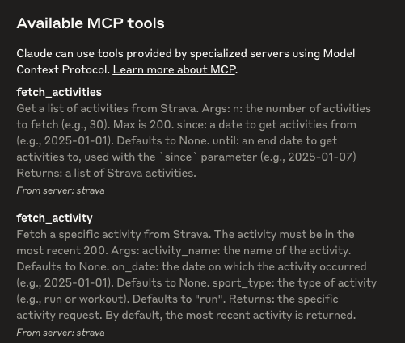
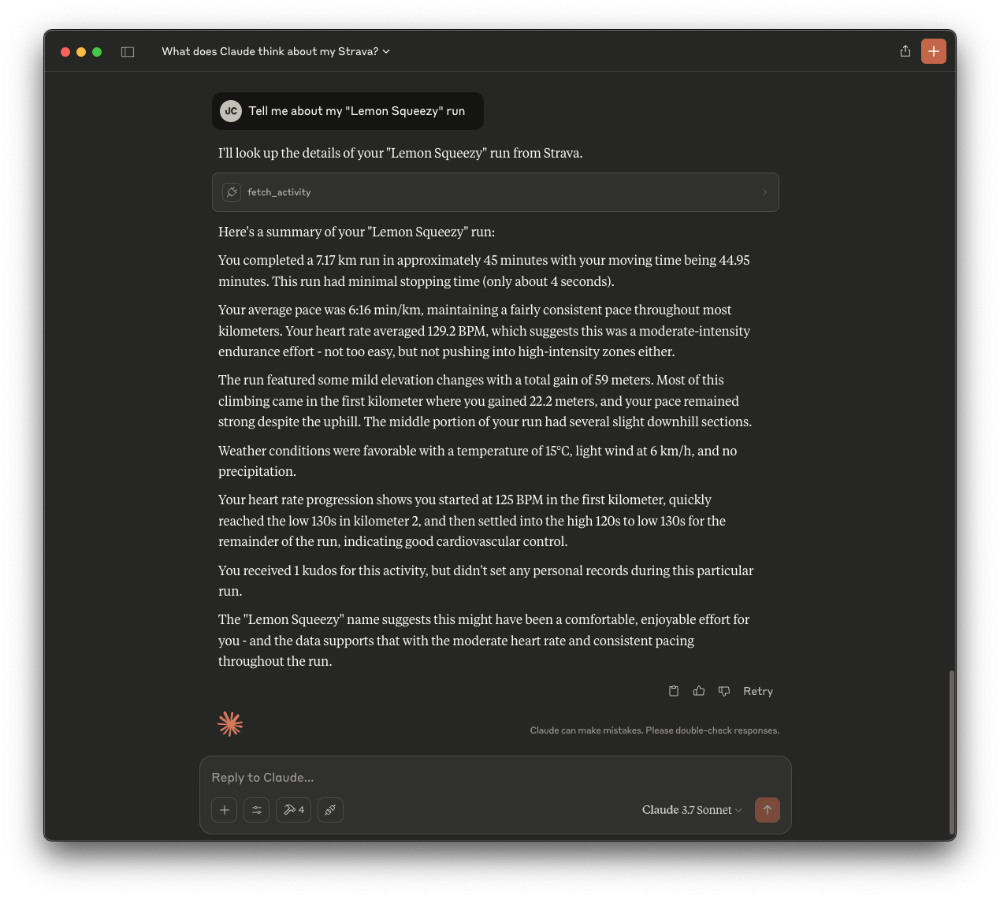

# Strava MCP

This repository contains a Strava MCP which you can add to your Claude Desktop client. Once installed, you'll be able to ask Claude all about your activities!

Checkout my blog post [here](https://jonocx.github.io/blog/2025/strava-mcp/)

## Setup

### Dependencies

- Claude Desktop
- `uv`
- A Stava account with a develop app setup

### Connecting to Strava

Once you have an [app setup](https://www.strava.com/settings/api) on your Strava profile and you've cloned this repository, create an `.env` file at the root with the following contents:

```bash
STRAVA_CLIENT_ID=<fill-me-in>
STRAVA_CLIENT_SECRET=<fill-me-in>
STRAVA_ACCESS_TOKEN=<fill-me-in>
STRAVA_REFRESH_TOKEN=<fill-me-in>
```

### Connecting the MCP to Claude

You can add the server to your Claude config by running the following:

```bash
uv run mcp install main.py
```

If you make changes to the server, you will need to restart your Claude desktop client.

Once installed, you should see a hammer icon at the bottom of the text box on your Claude app. If you click on it, it should show the following:



## Running

Now the server is added, Claude should be able to use it.

Try: "tell me about my latest activity".


